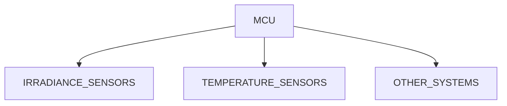
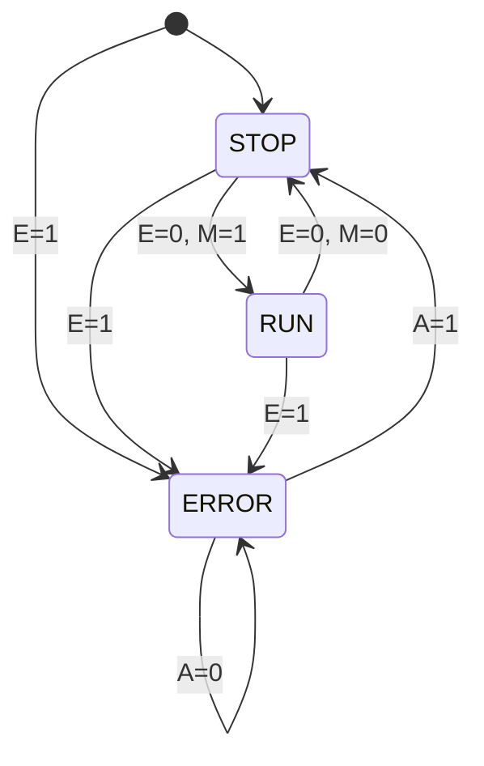
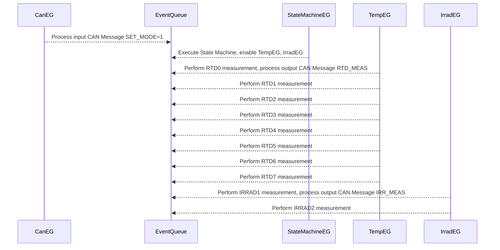

# BLACKBODY A SYSTEM DESIGN

This document describes the current operating structure and system design of the
Blackbody A PCB. It defines the tasks that should be run, the inputs and outputs
of the device, and the necessary communication protocols to interface with other
systems. 

---

## System design



The systems consists of a STM32 L432KC low power microcontroller sampling
TSL2591 irradiance sensors (Blackbody C) and RTDs (PT100s). It gathers this
data, processes it, and sends it to subscribed (pub-sub) participants. 

---

## Program execution

This device runs on a HLFSM, in which there are three states, **STOP**, **RUN**,
and **ERROR**. Transition between these states depend on error occurrence and
the latest SET_MODE and ACK_FAULT CAN messages, described further in
section [Communication](#communication). 


Program execution:
 - **1 Hz** cycle of HEARTBEAT LED to indicate liveliness
 - Messages for the Blackbody are captured and interpreted asynchronously.

STOP mode:
 - No measurements are active.

RUN mode:
 - When in the RUN mode, TRACKING LED is ON.
 - Default **10 Hz** sampling of each irradiance sensor (2) via I2C.
 - Default **2 Hz** sampling of each RTD sensor (8) via SPI.
 - samples are immediately broadcast to other boards via CAN.

ERROR mode:
 - When in the ERROR mode, ERROR LED is ON.
 - No measurements are active.

```
IS_ERROR = E
SET_MODE = M
ACK_FAULT = A
```



The overall system runs on an event queue; events are scheduled in this queue and
run on demand. We have several event generators:
- querying irradiance sensors,
- querying temperature sensors,
- changing state machine state,
- processing CAN messages.

> EG stands for event generator.



---

## Communication

I2C messages:
- Both devices respond to I2C address 0x29. **THIS IS A BUG.** It is recommended
  to create a patch version PCB where the devices are connected to an I2C device
  multiplexer. 

CAN messages:

| ADDRESS | NAME     | DIRECTION | NUM BYTES | DESCRIPTION                                          |
|---------|----------|-----------|-----------|------------------------------------------------------|
| 0x620   | HEARTBEAT| OUT       | 1         | Seconds/heartbeat cycles since startup.              |
| 0x621   | SET_MODE | IN        | 1         | 0x00 -> STOP, 0x01 -> RUN                            |
| 0x622   | BB_FAULT | OUT       | 2         | Error code, see [ERRORS](#errors)                    |
| 0x623   | ACK_FAULT| IN        | 1         | 0x01 -> Ack fault and return to STOP state           |
| 0x624   | RTD_CONF | IN        | 3         | MSB: enabled RTDs; LSB(2): RTD Sample freq. in Hz    |
| 0x625   | IRR_CONF | IN        | 3         | MSB: enabled IRRADs; LSB(2): IRRAD Sample freq. in Hz|
| 0x626   | RTD_MEAS | OUT       | 5         | MSB -> RTD ID, other, Temp in Celsius, float         |
| 0x627   | IRR_MEAS | OUT       | 5         | MSB -> IRRAD ID, other, Irrad in W/m^2, float        |

> If a fault has occured, then the controller must acknowledge the fault
(ACK_FAULT=1) and then restart sampling by setting the mode to RUN (SET_MODE=1). 

> The MSB of RTD_CONF and IRR_CONF is a bit packed struct indicating which sensors are
turned on; e.g. for RTD_CONF MSB:
>
> `0b1111_0001`
>
> RTDs 0, 4, 5, 6, 7 are enabled and 1, 2, 3 are disabled.

---

## ERRORS

| NUMBER | DESCRIPTION |
|--------|-------------|
| 0x00   | No fault.   |